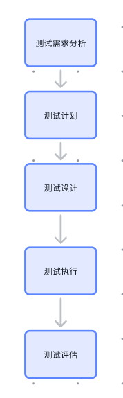

# 第1节：测试基础知识

作者：刘豆包

>沉淀、分享、成长，让自己和他人都能有所收获！:heart_eyes:

## 一、测试概念

- 软件测试是一系列活动以评价一个程序或系统的特性和能力并确定是否达到预期结果。

- 需要正向思维（验证软件可以正常工作）和逆向思维（假定有错误）

- 静态测试：需求评审、设计评审（看需求文档和设计文档）、代码评审

- 动态测试：运行程序来发现缺陷
## 二、测试类别
- 单元测试：测试单个模块，测试单个方法、类、函数，有静态和动态两种；
- 集成测试：测试多个模块，测试接口，模块按照设计要求组装同时测试；
- 系统测试：测试整个系统，软件放在实际环境中进行一系列测试；
- 验收测试：测试整个系统的最终结果，测试是否满足用户需求；
***
**1、 集成测试**
集成测试的目的是测试模块之间的接口是否正确，以及模块之间的数据传递是否正确；
分为 `一次性集成` 和 `渐增式集成`（自顶向下集成、自底向上集成、三明治集成） 两种集成方式；
***
**2、 系统测试**
系统测试的目的是验证系统是否满足需求规格说明书中的要求，测试整个系统，测试系统是否满足用户需求；
要进行：`恢复测试`、`安全测试`、`强度测试`、`性能测试`等
- 恢复测试：测试系统在遇到异常情况（如硬件故障、网络故障等）后，是否能够恢复正常；测试系统容错能力、自动恢复机制、人工干预恢复、数据一致性等；采用模拟故障注入、负载压力测试、人工模拟系统故障以及自动化测试工具等进行测试；
- 安全测试：测试系统是否存在安全漏洞，如 SQL 注入、跨站脚本攻击、缓冲区溢出等；采用静态代码分析、渗透测试、漏洞扫描、社会工程测试进行测试；
- 性能测试：测试系统在负载情况下，是否满足性能要求；测试系统并发处理能力、响应时间、吞吐量、资源利用率等；采用`负载测试`、`压力测试`、`容量测试`、`性能调优`进行测试；
- - 例：一个人背X斤
  **负载测试** ：200斤情况下，是否能坚持5分钟。（模拟超负荷运行，增减负载观察系统响应、吞吐量及资源占用，排查性能问题）
  **压力测试** ：200,300,400... 斤情况下，他的表现，什么 时候失败，失败之后什么表现，重新扛200是否正常。（强负载下（大数据量、高并发），查看系统峰值表现，检测功能隐患与恢复能力，分长时间稳定和极限破坏测试。）
  **容量测试** ：在坚持5分钟的情况下，他一次最多能扛多少斤。（找系统指标极限值（如最大并发数、记录数），验证极限下系统无故障或主要功能可用，面向数据确定处理容量。）

***
**3、 验收测试**
验收测试的目的是验证系统是否满足用户需求，测试整个系统，测试系统是否满足用户需求；
分为：正式验收测试、非正式验收测试（内部验收、Alpha测试、Beta测试）；
- 正式验收测试：由用户或用户代表对系统进行验收，测试结果由用户或用户代表决定；
- 非正式验收测试：由开发人员或测试人员对系统进行验收，测试结果由开发人员或测试人员决定；

***
**4、 回归测试**
回归测试的目的是验证系统是否满足需求规格说明书中的要求，测试整个系统，测试系统是否满足用户需求；在`软件维护阶段`进行的测试，当软件被修改后，确认修改没有引入新的错误，也没有影响到软件中其他功能的正确性；

***
## 三、测试方法
- 黑盒测试：不关心程序内部逻辑，只关心输入和输出，测试用例设计主要依据需求规格说明书；
- 白盒测试：关心程序内部逻辑，测试用例设计主要依据程序内部逻辑；
- 灰盒测试：介于黑盒测试和白盒测试之间，既关心输入和输出，也关心程序内部逻辑；

***
## 四、测试工具
- 单元测试工具：JUnit、TestNG、Mockito、PowerMock
- 集成测试工具：Spring Boot Test、Spring Test、Spring Security Test

- 系统测试工具：Selenium、Appium、JMeter、Postman
- 验收测试工具：JMeter、Postman、Jenkins、SonarQube
- 回归测试工具：Selenium、Appium、JMeter、Postman
- 性能测试工具：JMeter、Postman、Jenkins、SonarQube
- 安全测试工具：OWASP ZAP、Burp Suite、Nessus、Nmap
- 自动化测试工具：Selenium、Appium、JMeter、Postman

## 五、测试过程模型
- V模型：需求分析、设计、编码、单元测试、集成测试、系统测试、验收测试、维护；
- W模型：需求分析、设计、编码、单元测试、集成测试、系统测试、验收测试、维护；
- 敏捷测试模型：迭代开发、测试驱动开发、极限编程、极限测试、看板、瀑布模型；
- 

