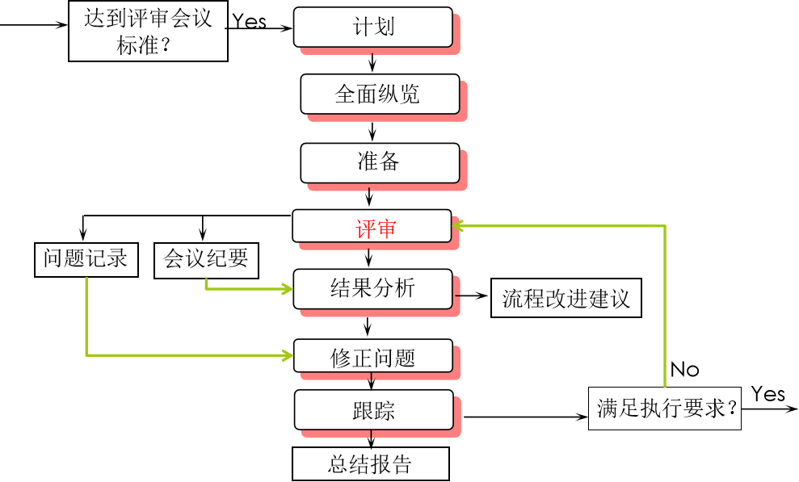
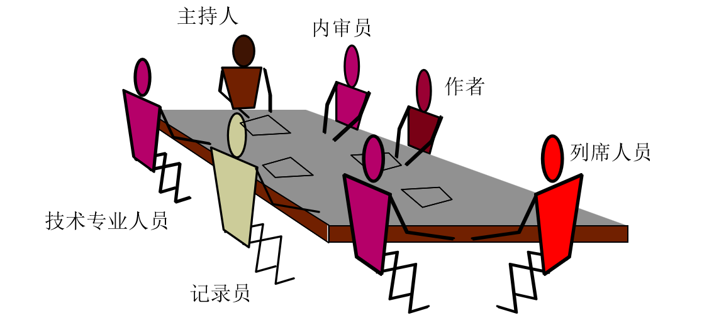
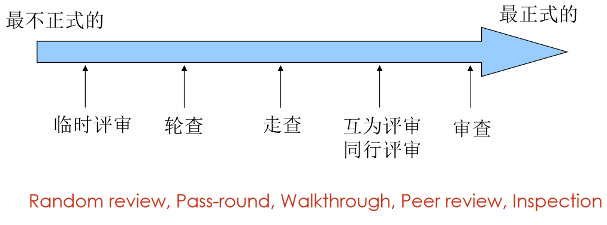
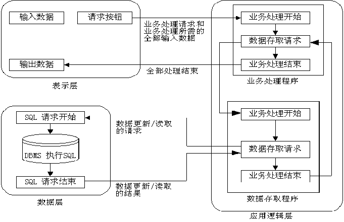
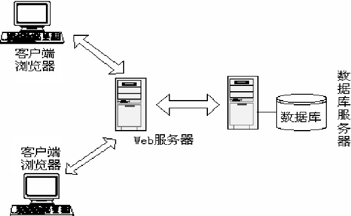
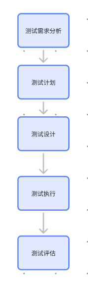

# 第2节：需求与设计评审是什么

作者：刘豆包

>沉淀、分享、成长，让自己和他人都能有所收获！😄

软件评审是对软件元素或者项目状态的一种评估手段，以确定其是否与计划的结果保持一致，并使其得到改进。
## 一、软件评审的分类
**软件测试范畴**
`1.技术评审`揭示软件需求、架构、逻辑、功能、算法上的各种错误，以确保软件需求规格说明书、设计文档没有技术问题，而且保持相互之间的一致性，能正确地开发出软件产品。
`2.文档评审`对软件过程中各类文档的格式、内容进行评审，检查文档格式是否符合标准，是否符合已有的模板，审查其内容是否前后一致，逻辑是否清晰，描述是否清楚等，是否符合已有模板。

**质量保证和管理范畴**
`1.管理评审`
`2.流程评审`

## 二、软件评审的方法及工具
**审查会议**
- 审查会议流程

- 参会人员构成

**审查方法:**

**评审工具**
&ensp;&ensp;&ensp;检查表、场景分析、头脑风暴和工具等
`检查表（checklist）`是一种常用的的质量保证手段，也是正式技术评审的必要工具，评审过程往往由检查表驱动。一份精心设计的检查表，对于提高评审效率、改进评审质量具有很大帮助。
可靠性：人们借助检查表以确认被检查对象的所有质量特征均得到满足，避免遗漏任何项目。
效率：检查表归纳了所有检查要点，比起冗长的文档，使用检查表具有更高的工作效率。

## 三、需求评审
**1. 概念 ：** 需求评审归为静态测试范畴，包含了文档评审和技术评审双重内容，通常通过正式的评审会议来进行。而测试人员主要起着评审员的作用，检查需求定义是否合理和清楚。

**2. 目的 ：** 发现需求定义中的问题，尽早发现缺陷，降低劣质成本。保证软件需求的可测试性。与市场、产品、开发等相关人员在需求理解上认识一致，以免后期的争吵。更好的理解产品的功能性与非功能性需求，为制定测试计划打下基础。确定测试目标与范围。虽然此后需求会发生变更，但能得到有效控制，降低测试风险。

**3. 评审方法：**分层、分类、分段
`分层`:高层从产品功能逻辑去分析，底层使用检查表逐项检查；
`分类`:按功能模块、非功能需求、业务流程、用户界面等分类评审；
`分段`:按阶段评审，如需求分析阶段、需求变更阶段、需求确认阶段等。

## 四、设计评审
**1. 概念 ：** 设计评审属于技术评审范畴，评审对象是设计文档，评审方法与需求评审类似，评审人员也是测试人员,要对`系统架构`、`设计规格说明书`、`系统部署设计`进行审查。
***
**2.系统架构审查：** 
`注意:`    
`1、整体系统不应存在单一故障点（没有备用组件）。`
`2、是否建立了故障转移机制，故障发生仍可用或快速回复。`
`3、是否建立了负载均衡机制，避免单点过载。`
`4、确定关键任务，保证关键任务设计合理。`
***
**C/S体系**：客户端/服务器体系，客户端负责与用户交互，服务器负责处理业务逻辑和数据存储。客户端和服务器之间通过网络进行通信。

**二层C/S体系**：在二层C/S体系结构中，客户端和服务器之间的通信是通过一个中间层来完成的，这个中间层通常是一个代理服务器或者一个应用服务器。
-  瘦客户机模型：客户端只负责与用户交互，不负责处理业务逻辑和数据存储。（部分web应用程序）
- 胖客户机模型：客户端负责与用户交互，同时也负责处理业务逻辑和数据存储。（需要下载完整的客户端程序，可以离线）

**三层C/S体系**：在三层C/S体系结构中，客户端和服务器之间的通信是通过一个中间层来完成的，这个中间层通常是一个应用服务器。应用逻辑层放在服务器，表示层只在客户机

**B/S体系**：浏览器/服务器体系，是三层体系结构的一种实现方式，客户端只需要一个浏览器，服务器负责处理业务逻辑和数据存储。客户端和服务器之间通过网络进行通信。具体结构为浏览器/Web服务器/数据库服务器。

**3. 组件设计审查：**
`注意:`    
`1、组件的功能和接口定义正确。`
`2、算法的有效性和优化。`
`3、合理的数据结构、数据流和控制流`
`4、功能、接口和数据设计具有可测试性、可预测性。`    
***

**耦合**：耦合是衡量模块间相互依赖程度的一个指标。耦合程度越高，模块间的相互依赖程度越高，模块独立性越差。耦合程度低，模块间的相互依赖程度越低，模块独立性越好。
- 尽量使用数据耦合
- 少用控制耦合
- 限制使用公共耦合（除非传递大量数据）
- 完全不用内容耦合

](../../assets/img/7耦合.png)
`非直接耦合`：两个模块之间没有直接关系，它们之间的联系完全是通过主模块的控制和调用来实现的。
`数据耦合`：两个模块之间通过参数传递数据。
`特征耦合`：两个模块之间通过参数传递数据，但传递的数据是某种特定类型的数据，如数组、结构体等。
`控制耦合`：两个模块之间通过参数传递控制信息，如函数调用、循环控制等。
`公共耦合`：两个模块之间通过共享的全局变量进行通信。
`内容耦合`：两个模块之间通过共享的全局变量进行通信，而且这些全局变量可以被修改，导致模块间的相互依赖程度非常高。

**内聚**：内聚是衡量同一个模块内部各个元素之间相互关联程度的一个指标。内聚程度越高，模块内部的各个元素之间的相互关联程度越高，模块的独立性越好。内聚程度低，模块内部的各个元素之间的相互关联程度越低，模块的独立性越差。
](../../assets/img/8内聚.png)
`功能内聚`：所有元素都是为了完成一个单一的功能而相互关联的，模块的独立性最好。
`顺序内聚`：所有元素按照一定的顺序执行，模块的独立性较好。
`通信内聚`：所有元素通过参数传递数据，模块的独立性较好。
`过程内聚`：所有元素都执行同一个过程，模块的独立性较好。
`时间内聚`：所有元素都在同一个时间内执行，模块的独立性较好。
`逻辑内聚`：所有元素都执行同一个逻辑，模块的独立性较好。
`偶然内聚`：所有元素都是执行不同的任务，模块的独立性较差。

# 五、界面设计审查
UI设计要易懂易用，一致和规范，美观独特，有自助功能提示信息，有错误保护