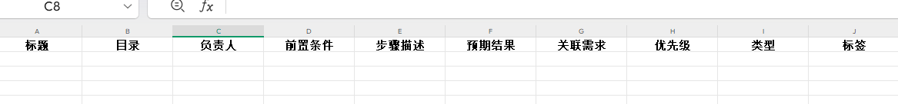

# 第4节: 如何写好测试用例

作者：刘豆包

>沉淀、分享、成长，让自己和他人都能有所收获！😄

`测试用例（test case）`是可以被独立执行的一个过程，是一个最小的测试实体，不能再被分解。
`测试用例`是由用例编号、用例标题、测试目的、测试类型（功能测试、性能测试等）、优先级（一般是P0-P3）、测试步骤、预期结果、实际结果、负责人等构成。  

ex:这是阿里云效平台的测试用例导入模版

前面有提到一个好的测试用例有什么特点（[3.测试测什么怎么测](3.测试测什么怎么测.md)），那么如何写好测试用例呢？
## 一、熟悉业务框架

熟悉业务框架是写好测试用例的前提，大概梳理业务逻辑，理清大小模块，不仅可以提高测试的效率并保障逻辑通顺，还可以后期整理测试点，提高测试的覆盖率。

## 二、熟悉业务需求和主场景
根据模块和原型加深对业务的了解，理清各个模块之间的关联，避免重要业务遗失，并为发散测试打基础，同时可以根据原型和经验找出不符合常理（用户）的需求和产品沟通。

## 三、设计测试用例

``下面有几个常用的设计用例方法：``

### 1. 等价类划分法

等价类划分法是将输入数据按照等价性划分为若干等价类，然后从每个等价类中选取一个数据作为测试用例。等价类划分法分为有效等价类和无效等价类。

`有效等价类`：对于程序的规格说明来说是合理的、有意义的输入数据构成的集合。  

`无效等价类`：与有效等价类相反，是那些对程序的规格说明来说不合理或无意义的输入数据构成的集合。

举例：
对于一个输入个数的字段，有效等价类可以是0到10之间的整数，无效等价类可以是小于 0、大于10、非整数等情况。

### 2. 边界值分析法

边界值分析法是对输入或输出的边界值进行测试的一种方法。通常，边界值分析法是作为对等价类划分法的补充，通常包括最小值、略小于最小值、最大值、略大于最大值等情况

举例:
对于一个输入个数的字段,限制0-10之间，边界值分析法可以是0、-1、10、11等边界值。

### 3. 场景法

场景法是一种基于业务流程的测试用例设计方法，它通过模拟用户在实际使用系统时的操作流程，设计出相应的测试用例。

举例：假设一个系统有一个用户注册的功能，用户需要输入用户名、密码、邮箱等基本信息，然后点击注册按钮。根据这个业务流程，可以设计出如下的测试用例：
1. 输入有效的用户名、密码、邮箱，点击注册按钮，验证是否成功注册。
2. 输入无效的用户名、密码、邮箱，点击注册按钮，验证是否提示错误信息。
3. 输入已存在的用户名、密码、邮箱，点击注册按钮，验证是否提示错误信息。
4. 输入未填写的用户名、密码、邮箱，点击注册按钮，验证是否提示错误信息。
5. 输入过长的用户名、密码、邮箱，点击注册按钮，验证是否提示错误信息。
6. 输入特殊字符的用户名、密码、邮箱，点击注册按钮，验证是否提示错误信息。
### 4. 错误推测法

错误推测法是一种基于经验和直觉的测试用例设计方法，它通过推测可能存在的错误，设计出相应的测试用例。

举例：假设一个系统有一个用户登录的功能，用户需要输入用户名和密码。根据经验和直觉，可以推测出如下的错误情况：
1. 输入错误的用户名和密码，验证是否提示错误信息。
2. 输入正确的用户名和错误的密码，验证是否提示错误信息。

`还有一些初级测试很有用但是不常用的方法，可以使设计用例时更全面但不臃肿`

### 5. 判定表法
判定表法是一种常用的测试用例设计方法，它可以根据程序的规格说明和输入输出之间的关系，设计出一个表格，列出所有可能的输入和输出情况，然后根据表格中的数据，设计出相应的测试用例。

举例：假设一个系统有两个输入条件 A 和 B，输出结果为 C。如果 A 为真且 B 为真，则 C 为真；如果 A 为假且 B 为假，则 C 为假。根据这个逻辑关系可以构建判定表并生成测试用例。
](../../assets/img/13判定表.png)

### 6. 因果图法
因果图法是一种基于逻辑关系的测试用例设计方法，它通过分析输入和输出之间的因果关系，设计出相应的测试用例。

举例：假设一个系统有两个输入条件 A 和 B，输出结果为 C。如果 A 为真且 B 为真，则 C 为真；如果 A 为假且 B 为假，则 C 为假。根据这个逻辑关系可以构建因果图并生成测试用例。

### 7. 正交实验法

正交实验法是一种基于数学方法的测试用例设计方法，它通过正交实验设计，设计出尽可能全面的测试用例。
正交表Ln(m^k)：

特点：均匀分散、整齐可比、高效、快速、经济

n：正交表的行数，也就是需要测试的组合的次数；

k：正交表的列数，也就是控件的个数；

m：是每个控件包含的取值个数；

## 四、编写测试用例
1.用例编号是为了方便查找和跟踪测试用例，一般按照一定的规则进行编号，例如：模块名称+功能名称+序号。  

2.用例标题是为了描述测试用例内容。  

3.测试目的是描述测试用例的测试目的，一般简洁明了。  

4.测试类型是描述测试用例的测试类型，一般是功能测试、性能测试等。  

5.优先级是为了描述测试用例的优先级，一般是P0-P3。  

6.测试步骤是描述测试用例的测试步骤，一般是按照测试流程进行描述。  

7.预期结果是描述测试用例的预期结果。  

8.实际结果是描述测试用例的实际结果。  

9.负责人是为了描述测试用例的负责人，一般是测试人员。  

